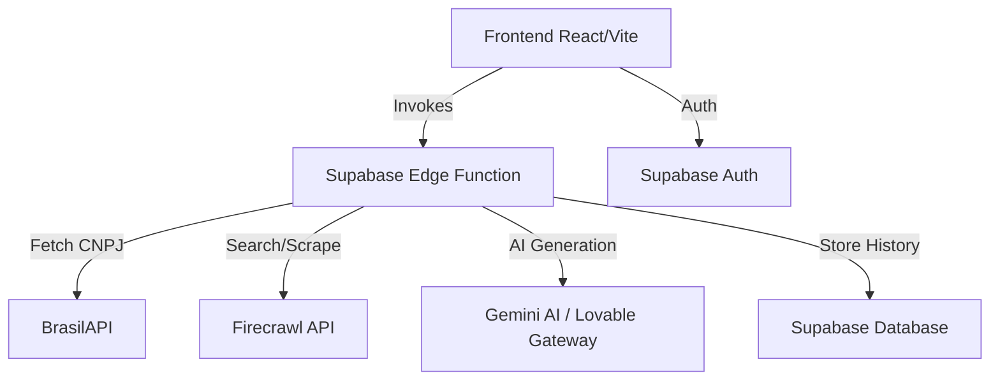

# Documentação Técnica - Intel B2B

## Arquitetura do Sistema
O Intel B2B é uma aplicação full-stack moderna construída sobre a infraestrutura do **Supabase**.



---

## Stack Tecnológica

### Frontend
- **Framework**: React 18 com Vite.
- **Linguagem**: TypeScript.
- **Estilização**: Tailwind CSS (utilizando o sistema Shadcn UI).
- **Gerenciamento de Estado/Cache**: React Query (@tanstack/react-query).
- **Roteamento**: React Router DOM v6.

### Backend (Supabase)
- **Edge Functions**: Funções Deno escritas em TypeScript.
- **Banco de Dados**: PostgreSQL com suporte a JSONB para armazenar os dossiês.
- **Autenticação**: Supabase Auth (Email/Senha).

---

## Fluxo de Inteligência (Lógica Cascade)
A função `generate-dossier` (`supabase/functions/generate-dossier/index.ts`) implementa uma lógica de busca em profundidade:

1.  **Extração de Input**: Detecta se o dado é e-mail, CNPJ ou Nome.
2.  **Identificação de Empresa**: 
    - Se for **Nome**, busca perfis no LinkedIn para identificar o nome da empresa e cargo do sócio.
    - Tenta associar o nome da empresa a um CNPJ via buscas especializadas.
3.  **Enriquecimento (BrasilAPI)**: Busca dados oficiais da Receita Federal (QSA, Capital Social, Atividade).
4.  **Enriquecimento (Firecrawl)**: 
    - Realiza buscas na web por notícias, processos judiciais, Reclame Aqui e sinais de crescimento.
    - Realiza o **Scraping do site da empresa** (se encontrado) para extrair tecnologias e portfólio.
5.  **Síntese por IA**: Envia o contexto consolidado (Receita + Web + Site) para a IA gerar o dossiê final.

---

## Banco de Dados

### Tabela: `dossier_history`
Armazena o histórico de todas as consultas bem-sucedidas.
- `id` (UUID): Chave primária.
- `input` (TEXT): O dado original digitado pelo usuário.
- `input_type` (TEXT): Tipo (email, cnpj, nome).
- `empresa_nome` (TEXT): Nome extraído da empresa.
- `empresa_cnpj` (TEXT): CNPJ formatado.
- `dossier_data` (JSONB): O objeto completo do dossiê (DossierResult).
- `created_at` (TIMESTAMP): Data da consulta.

---

## Lógica de Scoring (Lead Scoring V2)
Implementada em `src/lib/lead-scoring.ts`, a lógica calcula a pontuação com base nos seguintes pesos técnicos:
- **Dados Cadastrais**: Até 20 pontos.
- **Maturidade (Ano + Capital)**: Até 15 pontos.
- **Presença Digital (Domínios + Redes)**: Até 15 pontos.
- **Saúde Financeira**: Até 10 pontos (dedutivo baseado em nível de risco).
- **Fit Tecnológico**: Até 10 pontos (concorrentes diretos aumentam o score de oportunidade).

---

## Configuração do Ambiente

### Variáveis de Ambiente (Frontend `.env`)
```bash
VITE_SUPABASE_URL=...
VITE_SUPABASE_PUBLISHABLE_KEY=...
```

### Segredos (Supabase Secrets)
A função de borda requer os seguintes segredos configurados no Supabase:
- `FIRECRAWL_API_KEY`: Para buscas e scraping.
- `LOVABLE_API_KEY`: Para acesso à IA (Gemini).
- `SUPABASE_SERVICE_ROLE_KEY`: Para operações administrativas de banco de dados.
